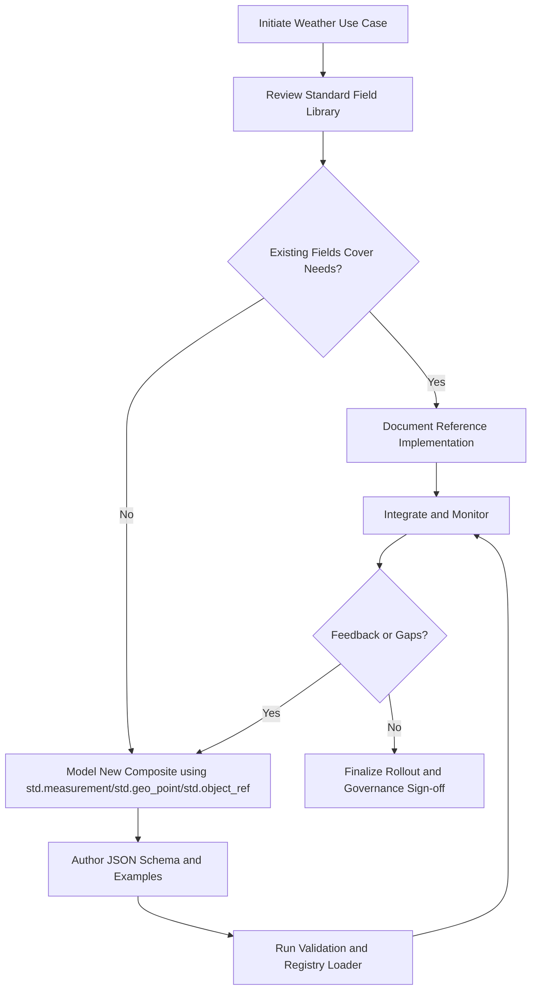

# Weather Data Field Extension Workflow

Defines the recommended workflow for introducing weather-centric data types into
the Knowledge Kernel Initiative while reusing the existing standard field
library.

## Objectives
- Capture atmospheric observations (temperature, humidity, wind, precipitation)
  without inventing redundant primitives.
- Reuse vetted composites such as `std.measurement`, `std.timestamp`, and
  `std.geo_point` to maintain consistency.
- Follow governance checkpoints so new schemas slot cleanly into registry,
  ingestion, and analytic pipelines.

## Composition Strategy

| Weather Concept | Standard Fields to Reuse | Notes |
| --- | --- | --- |
| Observation timestamp | `std.timestamp` | RFC 3339 timestamp for when the sensor reading occurred. |
| Station location | `std.geo_point` | Latitude, longitude, and optional altitude for the weather station. |
| Scalar readings (temperature, humidity, pressure) | `std.measurement` | Supplies value and unit pair (UCUM units like `Cel`, `%`, `Pa`). |
| Wind vector | `std.measurement` + `std.enum` | Speed as measurement; direction as enum. |
| Source metadata | `std.object_ref` | References upstream sensor registry or service. |

### Enumeration and Unit Decisions

- **Wind direction enum**: use the 16-point compass rose  
  `N`, `NNE`, `NE`, `ENE`, `E`, `ESE`, `SE`, `SSE`, `S`, `SSW`, `SW`, `WSW`, `W`, `WNW`, `NW`, `NNW`.  
  Ingestion must normalize numeric bearings (0-359 degrees) to the nearest bucket (22.5-degree span).
- **Weather code enum**: adopt the WMO SYNOP code 4680 list (00-99). Store codes as two-character strings
  such as `"00"` or `"89"`, and retain reserved codes like `"06"` and `"07"` for forward compatibility.
  Provide lookup tables keyed by the official CSV so UIs can surface icon and category metadata, plus the
  canonical WMO description stored in `weather_code_text`.
- **Cloud cover representation**: store percentage coverage (0-100) as the canonical value and derive a
  categorical bucket using WMO groupings `clear`, `few`, `scattered`, `broken`, `overcast`, `obscured`,
  `unknown`. Support layer granularity (low, mid, high) alongside the aggregate. When ingest inputs supply
  only the code, translate to both percent and category via the lookup table.
- **Observation quality enum**: start with `raw`, `qc_passed`, `qc_flagged`, `estimated`. Expand the list
  once upstream systems publish richer semantics.

### Measurement Unit Baselines (UCUM)

| Quantity | Primary Unit | Accepted Inputs | Notes |
| --- | --- | --- | --- |
| Temperature | `Cel` | `Cel`, `degF`, `K` | Store as Celsius; auto-convert from degF or Kelvin. |
| Relative humidity | `%` | `%`, `1` | Treat unitless fractions as percentages multiplied by 100. |
| Dew point and heat index | `Cel` | `Cel`, `degF` | Normalize to Celsius. |
| Atmospheric pressure | `hPa` (equivalent to `mbar`) | `hPa`, `Pa`, `inHg` | Convert to hectopascals. |
| Wind speed and gust | `km/h` | `km/h`, `m/s`, `mph`, `kn` | Convert to kilometers per hour. |
| Precipitation amount | `mm` | `mm`, `cm`, `in` | Convert to millimeters. |
| Snowfall depth | `cm` | `cm`, `mm`, `in` | Convert to centimeters; store liquid equivalent separately if required. |
| Visibility | `km` | `km`, `m`, `mi` | Convert to kilometers. |
| Cloud cover | `%` | `%` | Store 0-100 for total and layer-specific coverage. |
| Solar radiation | `W/m2` | `W/m2` | Extend if ingest sources provide alternative units. |
| Ozone (column) | `DU` | `DU`, `ug/m3` | Convert to Dobson Units when column data is supplied; document assumptions for surface readings. |
| Air quality index | Dimensionless | Numeric scales | Store as integer 0-500; map localized indices to the canonical range. |
| UV index | Dimensionless | Numeric 0-11+ | Clamp to the published WHO scale. |

### Source Mapping Example (Open-Meteo)

| Open-Meteo Column | Field Property | Transform Notes |
| --- | --- | --- |
| `time` | `observed_at` | Copy as RFC 3339 string. |
| `temperature_2m (degC)` | `temperature` | Wrap as `std.measurement` with unit `Cel`. |
| `relativehumidity_2m (%)` | `humidity` | Store percent directly; ensure 0-100 bounds. |
| `dewpoint_2m (degC)` | `dew_point` | Map to measurement (`Cel`). |
| `apparent_temperature (degC)` | `apparent_temperature` | Map to measurement (`Cel`). |
| `surface_pressure (hPa)` | `pressure` | Map to measurement (`hPa`). |
| `precipitation (mm)` | `precipitation` | Map to measurement (`mm`). |
| `rain (mm)` | `rain` | Map to measurement (`mm`). |
| `snowfall (cm)` | `snowfall` | Map to measurement (`cm`); convert if alternative units arrive. |
| `weathercode (wmo code)` | `weather_code` / `weather_code_text` | Store code as two-character string and look up textual description + icon/category via WMO table. |
| `cloudcover (%)` | `cloud_cover.percent` | Keep percentage; derive `cloud_cover.category` via lookup. |
| `cloudcover_low (%)` | `cloud_cover_layers.low` | Store 0-100 percent. |
| `cloudcover_mid (%)` | `cloud_cover_layers.mid` | Store 0-100 percent. |
| `cloudcover_high (%)` | `cloud_cover_layers.high` | Store 0-100 percent. |
| `windspeed_10m (km/h)` | `wind.speed` | Already km/h; coerce to measurement. |
| `winddirection_10m (deg)` | `wind.direction` | Convert numeric bearing to nearest 16-point compass value. |
| `windgusts_10m (km/h)` | `wind.gust` | Map to measurement (`km/h`). |

### Example Composite Sketch

```json
{
  "id": "std.weather.observation",
  "fieldType": "composite",
  "dataType": "object",
  "properties": {
    "observed_at": { "$ref": "./timestamp.json" },
    "location": { "$ref": "./geo_point.json" },
    "temperature": { "$ref": "./measurement.json" },
    "humidity": { "$ref": "./measurement.json" },
    "pressure": { "$ref": "./measurement.json" },
    "dew_point": { "$ref": "./measurement.json" },
    "apparent_temperature": { "$ref": "./measurement.json" },
    "weather_code": {
      "type": "string",
      "enum": [
        "00","01","02","03","04","05","06","07","08","09",
        "10","11","12","13","14","15","16","17","18","19",
        "20","21","22","23","24","25","26","27","28","29",
        "30","31","32","33","34","35","36","37","38","39",
        "40","41","42","43","44","45","46","47","48","49",
        "50","51","52","53","54","55","56","57","58","59",
        "60","61","62","63","64","65","66","67","68","69",
        "70","71","72","73","74","75","76","77","78","79",
        "80","81","82","83","84","85","86","87","88","89",
        "90","91","92","93","94","95","96","97","98","99"
      ]
    },
    "weather_code_text": {
      "type": "string",
      "minLength": 1,
      "maxLength": 128,
      "description": "Human-readable WMO description (e.g., 'Rain, not freezing, moderate')."
    },
    "cloud_cover": {
      "type": "object",
      "properties": {
        "percent": {
          "type": "number",
          "minimum": 0,
          "maximum": 100
        },
        "category": {
          "type": "string",
          "enum": ["clear","few","scattered","broken","overcast","obscured","unknown"]
        }
      },
      "required": ["percent"],
      "additionalProperties": false
    },
    "cloud_cover_layers": {
      "type": "object",
      "properties": {
        "low": { "type": "number", "minimum": 0, "maximum": 100 },
        "mid": { "type": "number", "minimum": 0, "maximum": 100 },
        "high": { "type": "number", "minimum": 0, "maximum": 100 }
      },
      "additionalProperties": false
    },
    "quality_flag": {
      "type": "string",
      "enum": ["raw","qc_passed","qc_flagged","estimated"]
    },
    "wind": {
      "type": "object",
      "properties": {
        "speed": { "$ref": "./measurement.json" },
        "direction": {
          "type": "string",
          "enum": ["N","NNE","NE","ENE","E","ESE","SE","SSE","S","SSW","SW","WSW","W","WNW","NW","NNW"]
        },
        "gust": { "$ref": "./measurement.json" }
      },
      "required": ["speed"],
      "additionalProperties": false
    },
    "precipitation": { "$ref": "./measurement.json" },
    "rain": { "$ref": "./measurement.json" },
    "snowfall": { "$ref": "./measurement.json" },
    "visibility": { "$ref": "./measurement.json" },
    "solar_radiation": { "$ref": "./measurement.json" },
    "ozone": { "$ref": "./measurement.json" },
    "air_quality_index": { "type": "integer", "minimum": 0, "maximum": 500 },
    "uv_index": { "type": "number", "minimum": 0, "maximum": 15 },
    "source": { "$ref": "./object_reference.json" }
  }
}
```

### Field Packaging Checklist
1. Confirm UCUM codes for each measurement (for example `Cel` for temperature and `hPa` for pressure).
2. Decide whether derived convenience values (heat index, dew point, apparent temperature) belong in the same composite or as separate derived fields.
3. Validate that ingest pipelines can supply each measurement; mark properties optional otherwise.
4. Maintain lookup tables for weather codes and cloud-cover buckets, including icon and category metadata for UI surfaces.
5. Implement unit conversion adapters so ingest sources using imperial units or fractional humidity normalize to the baselines above.

## Workflow Stages

| Stage | Primary Activities | Deliverables |
| --- | --- | --- |
| Discovery | Gather requirements from analytics, dashboard, and ingestion teams. Map weather use cases to existing field primitives. | Requirements brief referencing standard field library sections. |
| Modeling | Draft composite and derived field definitions, enumerations, and validation rules. Align units with UCUM and governance policies. | Markdown spec (like this document) plus preliminary JSON Schema sketches. |
| Schema Authoring | Implement JSON Schema files under `schema/fields/` using `$ref` composition. Include examples under `docs/specs/examples/`. | `schema/fields/weather_observation.json`, updated example payloads. |
| Validation | Extend schema tests or fixtures (for example, `tests/fixtures/items/`) to cover new payloads. Run validation tooling. | Passing test suite and ingestion smoke results. |
| Registry Integration | Register new field IDs via the registry loader; update capability contracts or item schemas referencing the weather composites. | Updated manifests and change-log entries. |
| Rollout and Governance | Communicate availability, monitor usage, capture feedback, and iterate through change control if adjustments are needed. | Release notes and backlog items for enhancements. |

## Schema Artifacts
- `schema/fields/measurement.json` — reusable measurement primitive (value + unit).
- `schema/fields/geo_point.json` — canonical geospatial point.
- `schema/fields/weather_observation.json` — composite weather observation schema.
- `docs/specs/examples/weather_observation_examples.md` — canonical payload samples.

## Process Flowchart



## Governance Considerations
- Ensure sensitivity classification and realm policies apply; weather data is typically non-sensitive but must declare owner and retention expectations.
- Document derived metrics separately (for example, forecasted precipitation) using the derived value framework so provenance remains traceable.
- Coordinate with naming conventions to reserve the `std.weather.*` namespace and prevent conflicts with vendor-specific schema contributions.

Following this workflow keeps weather-focused extensions aligned with the existing registry and simplifies ingestion, validation, and downstream analytics adoption.
